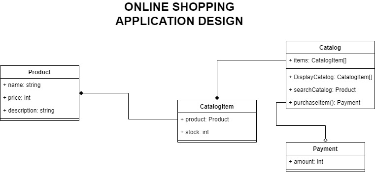

# Online shopping application - CSC 322

Programmed in the C programming language

## Provides the following services

1. Display catalog
2. Search for an item in the catalog
3. Purchase an item
4. Payment to complete a purchase

## Design Diagram

## How to run

1. Clone the repository
2. Build and run main.c - the code does not require any external dependencies
